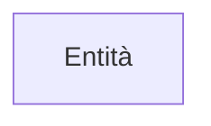
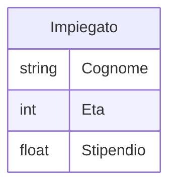

# Cosa sono?
Sono dei costrutti del [[Introduzione Modello ER|Modello ER]] che hanno lo scopo di rappresentare classi di oggetti che hanno proprietà comuni ed esistenza autonoma
## Rappresentazione Grafica

---
# Attributi di una Entità
## Attributi "Semplici"
Descrivono le proprietà elementari di una entità

Un attributo associa a ciascuna occorrenza di un entità un valore appartenente ad un insieme detto dominio

## Attributi Composti
Può risultare comodo raggruppare attributi di una medesima entità che presentano affinità nel loro significato o uso

L'insieme di attributi che si ottiene in questa maniera viene detto attributo composto
