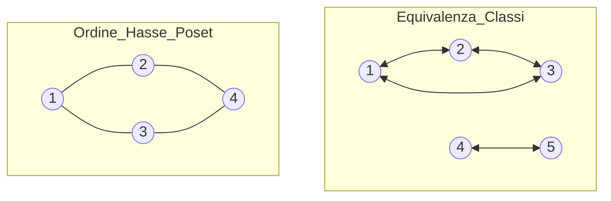

# 🔗 Guida Completa alle Relazioni: Proprietà e Strutture

Una relazione $R$ su un insieme $A$ è un sottoinsieme del prodotto cartesiano $A \times A$. Per l'esame, è fondamentale saperle analizzare tramite **Matrice Booleana** $M$ (usando 0 e 1) o **Grafo Orientato** $G$.

---

## 1. Proprietà Fondamentali: Come riconoscerle

| Proprietà | Definizione Formale | Matrice Booleana ($M$) | Grafo Orientato ($G$) |
| :--- | :--- | :--- | :--- |
| **Riflessiva** | $\forall x, xRx$ | Tutti **1** sulla diagonale principale. | Ogni nodo ha un **cappio** (auto-anello). |
| **Antiriflessiva** | $\forall x, \neg(xRx)$ | Tutti **0** sulla diagonale principale. | **Nessun nodo** ha un cappio. |
| **Simmetrica** | $xRy \implies yRx$ | Matrice simmetrica ($M = M^T$). | Ogni freccia $x \to y$ ha la sua inversa $y \to x$. |
| **Antisimmetrica**| $(xRy \land yRx) \implies x=y$ | Se $M_{ij}=1$ ($i \ne j$), allora $M_{ji}=0$. | Tra due nodi diversi c'è **al massimo** una freccia. |
| **Assimmetrica** | $xRy \implies \neg(yRx)$ | Se $M_{ij}=1$, allora $M_{ji}=0$ **E** diagonale a 0. | Solo frecce "sola andata" e **niente cappi**. |
| **Transitiva** | $(xRy \land yRz) \implies xRz$ | $M^2 \le M$ (prodotto booleano). | Se c'è un percorso $x \to y \to z$, c'è anche $x \to z$. |

---

## 2. Focus: Assimmetrica vs Antisimmetrica
Questa è la distinzione più importante per non perdere punti:

* **Antisimmetrica**: "Niente doppie frecce tra nodi diversi, ma **i cappi sono ammessi**".
    * Esempio: $\le$ (Minore o uguale). $5 \le 5$ è vero (cappio ammesso).
* **Assimmetrica**: "Niente doppie frecce **E niente cappi**". È una proprietà più forte che implica l'antiriflessività.
    * Esempio: $>$ (Maggiore di). $5 > 5$ è falso (cappio vietato).

---

## 3. Strutture Relazionali Speciali

### 🤝 Relazione di Equivalenza
**Proprietà**: Riflessiva + Simmetrica + Transitiva.
- **Matrice**: Se i nodi sono ordinati per classi, vedi blocchi quadrati di 1 sulla diagonale.
- **Grafo**: Formato da componenti connesse (isole) dove ogni nodo punta a tutti gli altri della stessa isola.
- **Scopo**: Genera l'**Insieme Quoziente** $A/R$ suddiviso in **Classi di Equivalenza**.

### 📐 Ordine Parziale (Poset)
**Proprietà**: Riflessiva + Antisimmetrica + Transitiva.
- **Rappresentazione**: Si usa il **Diagramma di Hasse**, eliminando cappi e frecce transitive per mostrare solo le relazioni dirette verso l'alto.
- **Esempio**: La relazione di divisibilità ($x|y$).

### 📏 Preordine
**Proprietà**: Riflessiva + Transitiva.
- **Differenza**: A differenza del Poset, ammette cicli tra nodi diversi (non è antisimmetrica).

---

## 🚀 Metodi di Verifica Rapida

### Tramite Matrice (0/1)
1.  **Riflessività**: Controlla la diagonale. Se c'è anche solo uno **0**, la relazione non è riflessiva.
2.  **Simmetria**: Piega la matrice lungo la diagonale: le metà devono essere identiche.
3.  **Antisimmetria**: Se vedi un **1** in posizione $(i,j)$, controlla la posizione $(j,i)$: deve esserci uno **0** (tranne sulla diagonale).

### Tramite Grafo
1.  **Transitività**: Se puoi andare da A a C passando per B, deve esserci una freccia diretta A $\to$ C.
2.  **Equivalenza**: Il grafo deve sembrare un insieme di "isole" dove tutti gli abitanti di un'isola si conoscono tra loro.

> [!tip] Ricorda per l'Insieme Quoziente
> Il numero di "isole" (componenti) nel grafo di una relazione di equivalenza corrisponde esattamente al numero di classi di equivalenza nell'insieme quoziente.