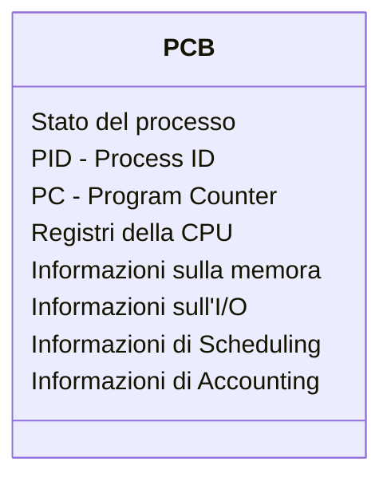
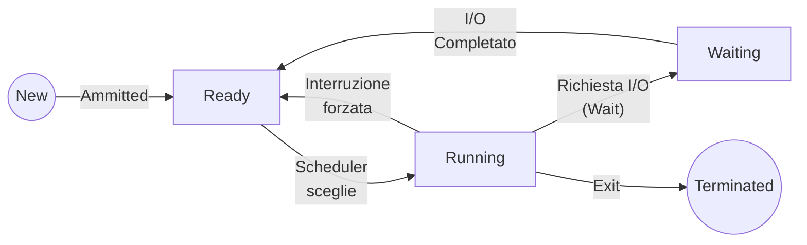

# Cos'è
---
# Cosa fa?
---
# Processo vs Programma
---
# Immagine di un processo
---
# PCB - Process Control Block
Il PCB è la struttura dati fondamentale che il kernel utilizza per rappresentare e gestire ogni singolo processo, le informazioni che contiene sono : 
- ### Stato del processo
  La condizione attuale del processo
- ### PID - Process ID
  Il numero identificativo del processo
- ### PC - Program Counter
  L'indirizzo della prossima istruzione da eseguire
- ### Registri della CPU
  Il contenuto salvato dei registri del processore
- ### Informazioni sulla memoria
  I limiti della memoria allocata al processo
- ### Informazioni sull'I/O
  L'elenco dei dispositivi assegnati e dei file aperti
- ### Informazioni di [[Scheduling dei processi |Scheduling]]
  La priorità del processo e i puntatori alle code di scheduling
- ### Informazioni di Accounting
  Statiche come il tempo di CPU utilizzato e il tempo trascorso dall'avvio

---
# Stato di un processo
## Cos'è?
Lo stato di un processo rappresenta la condizione attuale in cui si trova il processo in preciso istante della sua esecuzione.

Poichè un processo non esegue tutte le sue istruzioni in un colpo solo, il sistema operativo deve tenere traccia "di cosa sta facendo" ogni processo per gestirlo correttamente.

Lo stato in un processo è un informazione memorizzata all'interno del [[#PCB - Process Control Block | PCB]]
## Quali sono
###  New
IL processo è stato appena creato ma non è ancora stato ammesso dal sistema operativo nella memoria principale per l'esecuzione
### Ready
Il processo è stato caricato in memoria ed è pronto ad essere eseguito
### Running
Il processo ha ottenuto la CPU, le sue istruzioni stanno venendo eseguite
### Waiting
Il processo non può eseguire, nemmeno se la CPU fosse libera.

Si è bloccato volontariamente perchè deve attendere un evento esterno per poter proseguire

### Terminated
Il processo ha concluso la sua esecuzione e il sistema operativo sta rilasciando le risorse che occupava

## Diagramma delle transizioni
