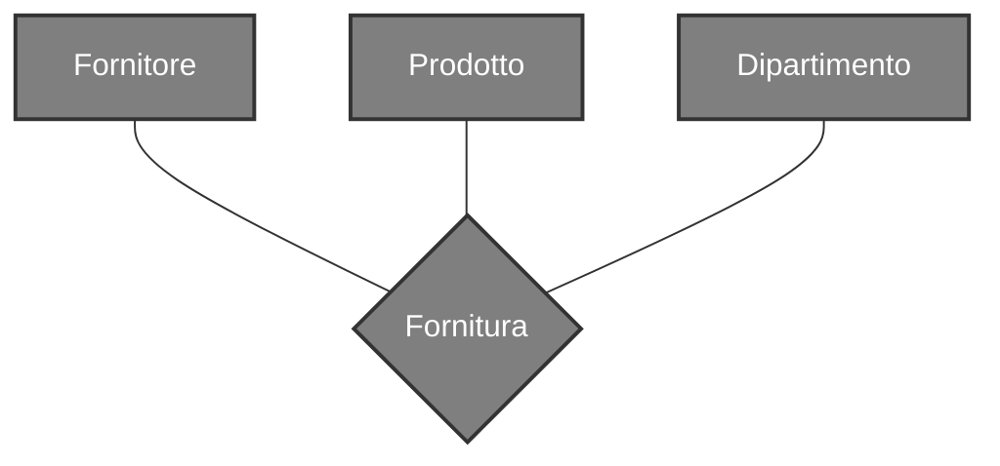
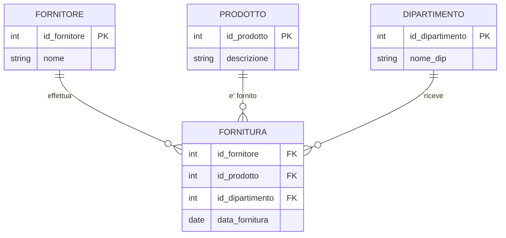
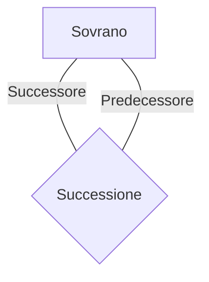
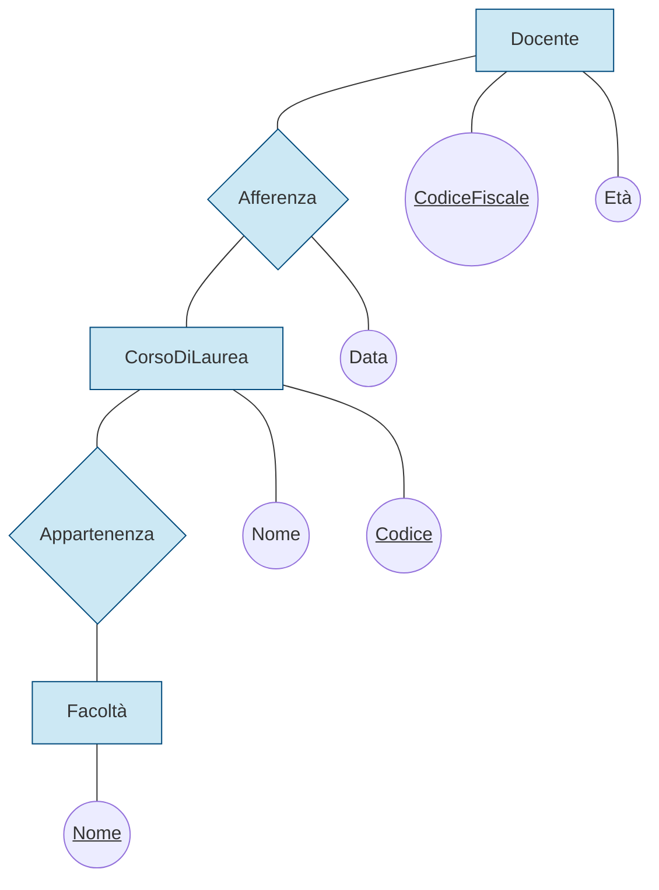
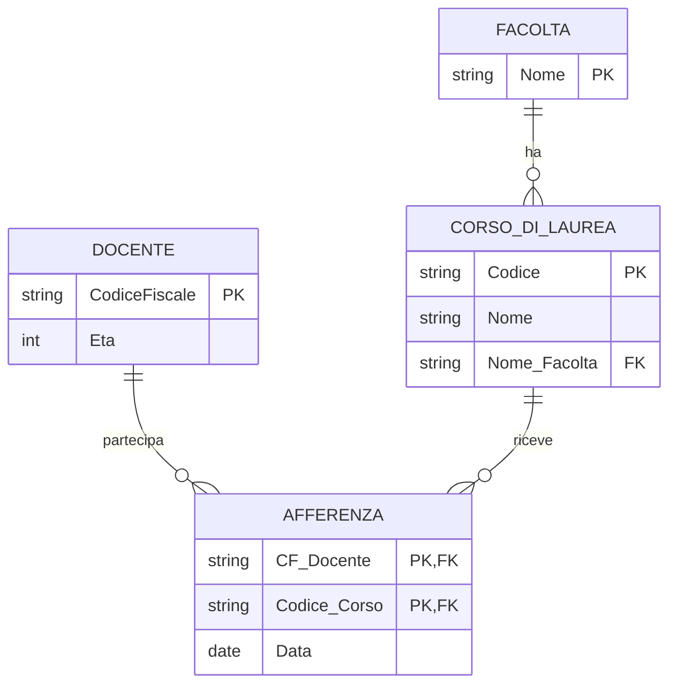
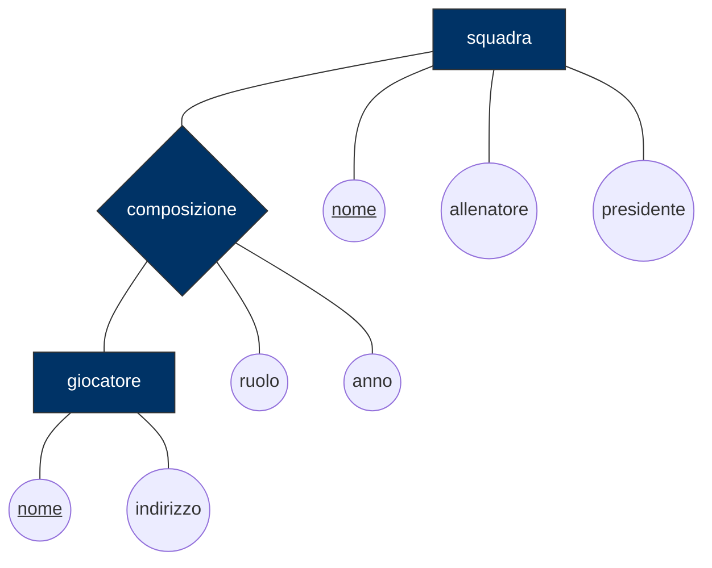
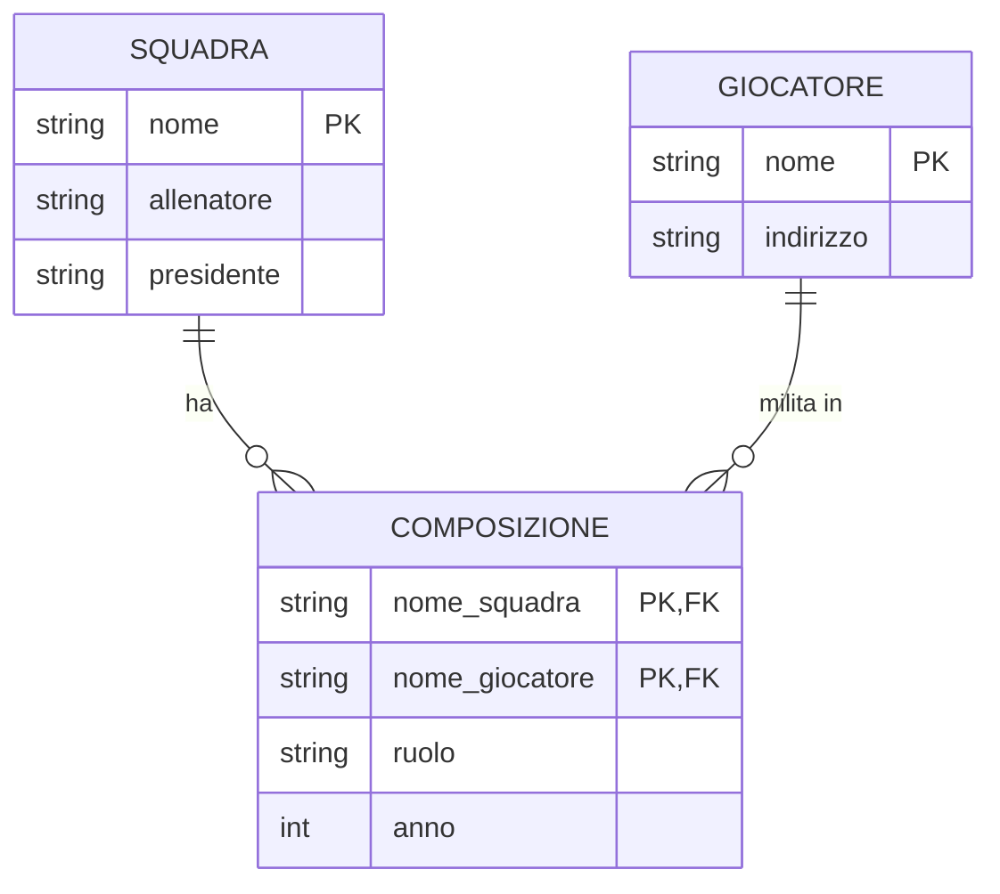
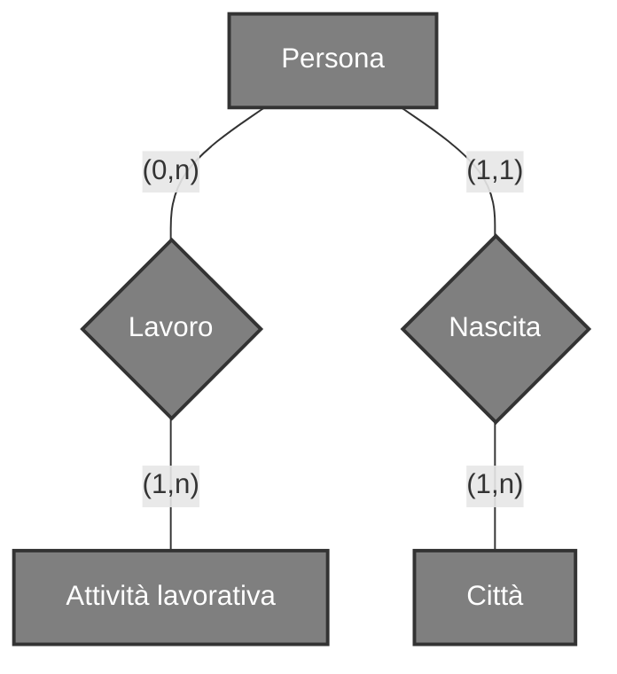
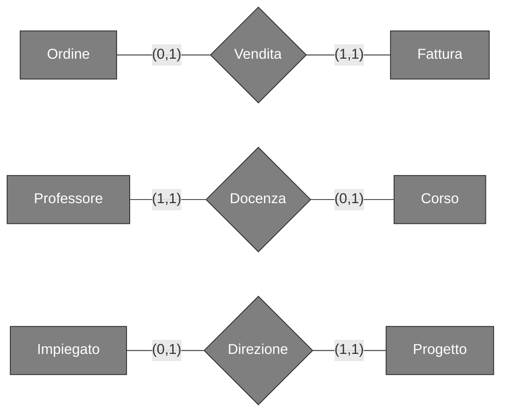
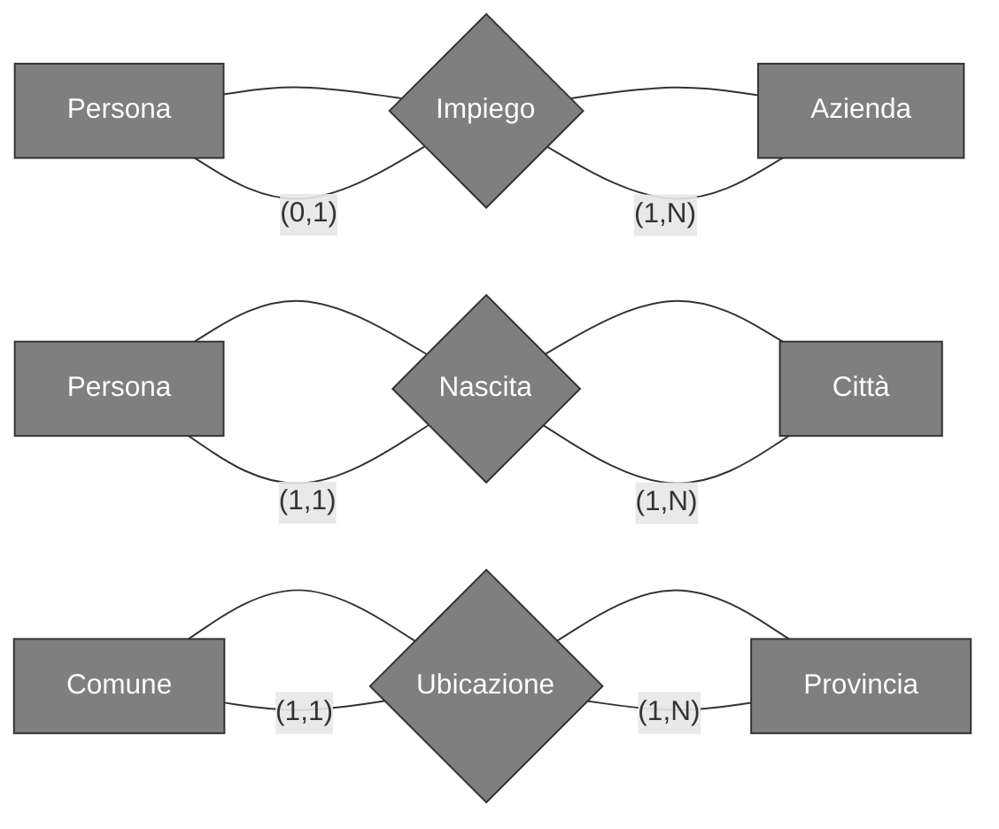

# Cosa sono?
Rappresentano legami logici tra 2 o più [[Entità]] 




---
# Tipi di relazione
## Relazioni Ricorsive
Sono relazioni tra un [[Entità]] e se stessa, nelle relazioni di questo tipo è necessario aggiungere la specifica dei ruoli

 ```mermaid
 erDiagram
    SOVRANO {
        int ID_Sovrano PK
        string Nome
        int ID_Predecessore FK
    }
    
    SOVRANO ||--o| SOVRANO : "e' succeduto da"
 ```
## Relazioni $n$-arie
Sono relazioni che coinvolgono dalle 2 alle $n$ entità



---
# Attributi
Un attributo su una relazione associa a ogni occorrenza del legame un valore appartenente a un dominio specifico. Descrive una proprietà che ha senso **solo se il legame esiste**


---
# Cardinalità
Vengono specificate per ciascuna partecipazione di [[Entità]] a una relazione

Dicono quante volte, in una relazione tra [[Entità]], un'occorrenza di una di queste entià può essere legata a occorrenze delle altre entità coinvolte


## Cardinalità 1 a 1

## Cardinalità 1 a molti

## Cardinalità molti a molti