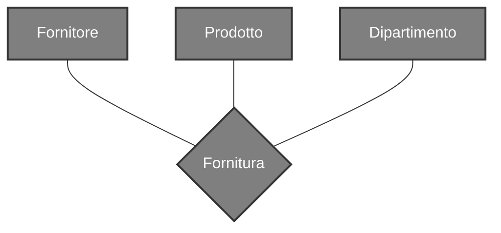
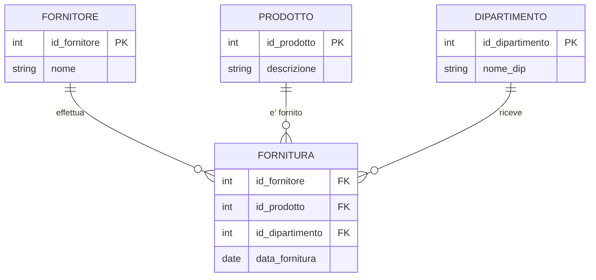
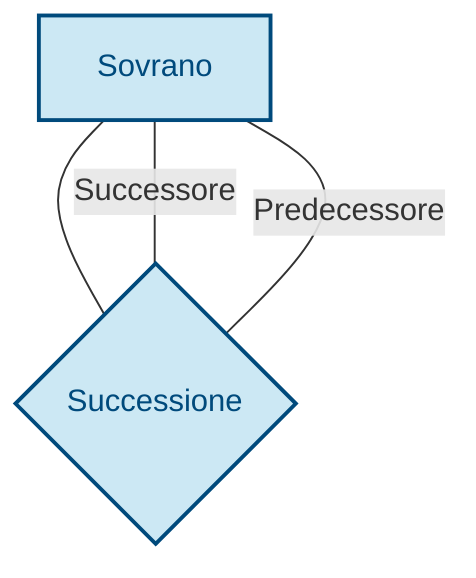

# Cosa sono?
Rappresentano legami logici tra 2 o più [[Entità]] 

---
# Tipi di relazione
## Relazioni Ricorsive
Sono relazioni tra un [[Entità]] e se stessa, nelle relazioni di questo tipo è necessario aggiungere la specifica dei ruoli

---
# Attributi
