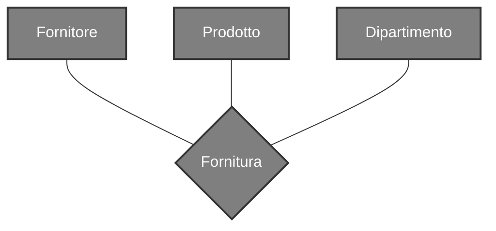
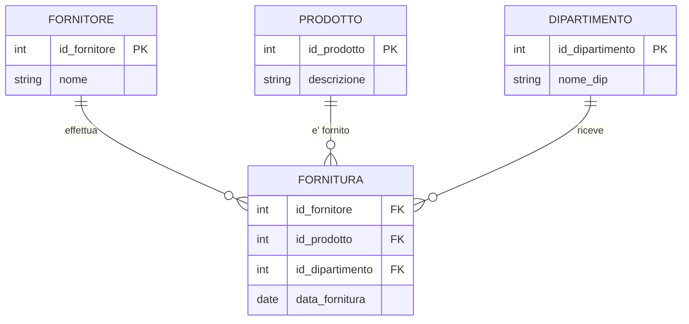
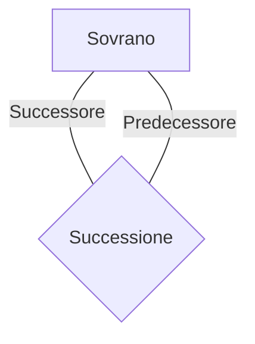
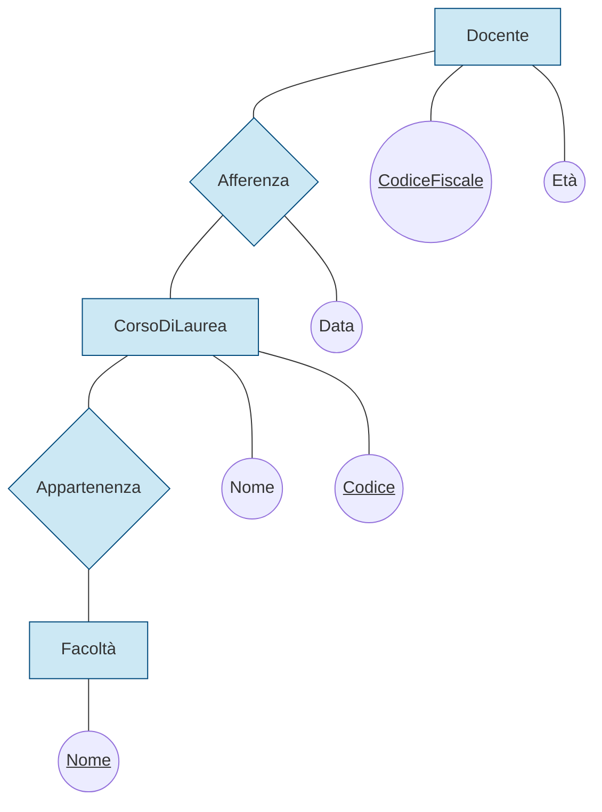
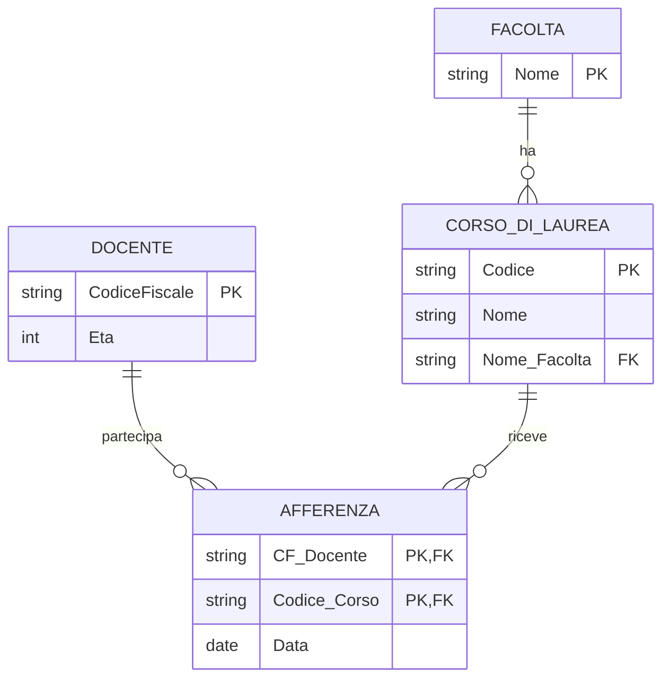

# Cosa sono?
Rappresentano legami logici tra 2 o più [[Entità]] 




---
# Tipi di relazione
## Relazioni Ricorsive
Sono relazioni tra un [[Entità]] e se stessa, nelle relazioni di questo tipo è necessario aggiungere la specifica dei ruoli

 ```mermaid
 erDiagram
    SOVRANO {
        int ID_Sovrano PK
        string Nome
        int ID_Predecessore FK
    }
    
    SOVRANO ||--o| SOVRANO : "e' succeduto da"
 ```
## Relazioni $n$-arie
Sono relazioni che coinvolgono dalle 2 alle $n$ entità



---
# Attributi
