# Cosa sono?
Sono dei costrutti del [[Modello ER|Modello ER]] che hanno lo scopo di rappresentare classi di oggetti che hanno proprietà comuni ed esistenza autonoma

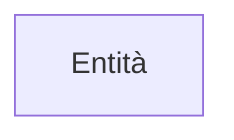
---
# Attributi di una Entità
## Attributi "Semplici"
Descrivono le proprietà elementari di una entità

Un attributo associa a ciascuna occorrenza di un entità un valore appartenente ad un insieme detto dominio
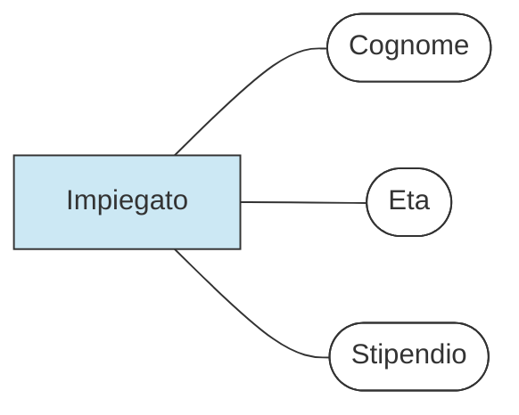

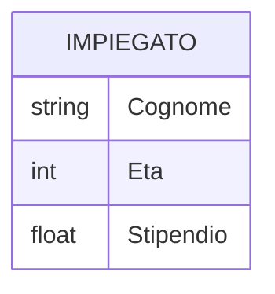
## Attributi Composti
Può risultare comodo raggruppare attributi di una medesima entità che presentano affinità nel loro significato o uso

L'insieme di attributi che si ottiene in questa maniera viene detto attributo composto
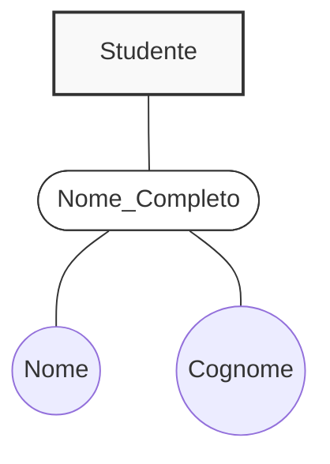

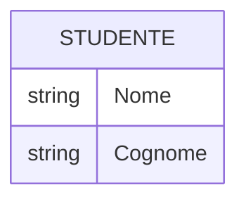
## Cardinalità degli attributi
È il numero minimo e massimo di valori dell'attributo associai a ogni occorrenza di entità o relazione 
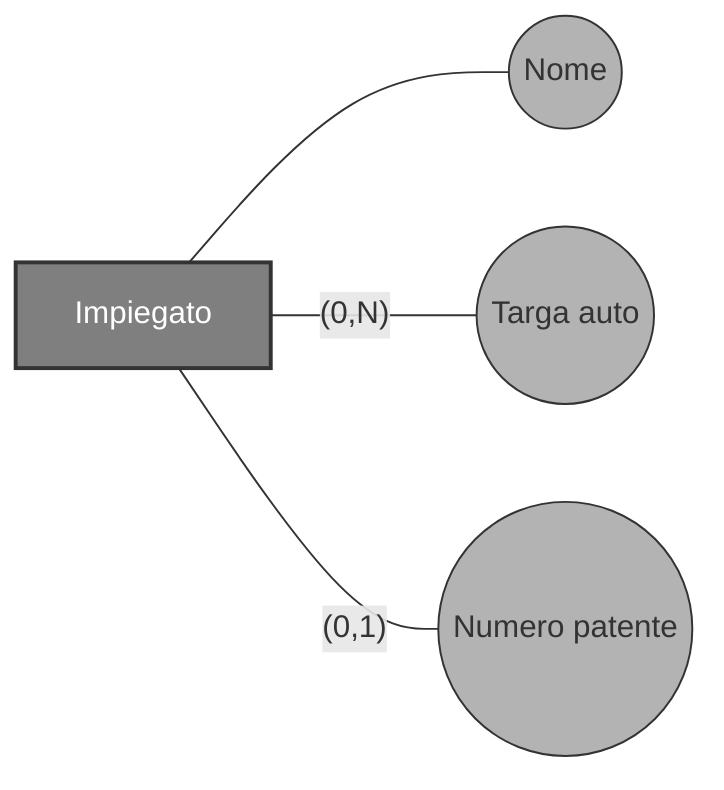
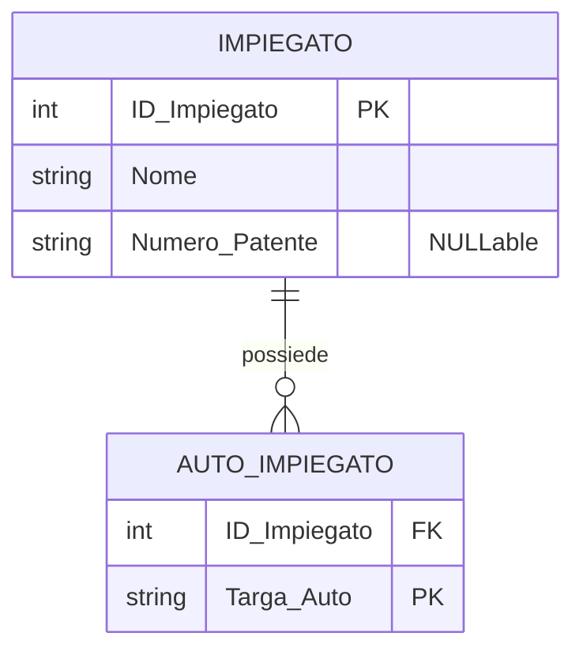

---
# Identificatori
Sono degli [[#Attributi di una Entità|attributi]] univoci definiti per ogni entità dediti alla identificazione di un entità

Essi possono essere
## Identificatori interni
Identificatore formato da uno o più attributi di una sola entità
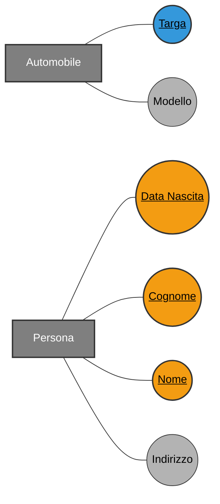
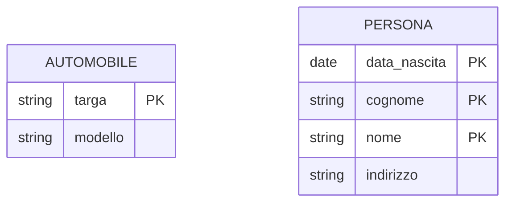
## Identificatori Esterni
Se l'identificatore è formato da attributi e [[Relazioni]]

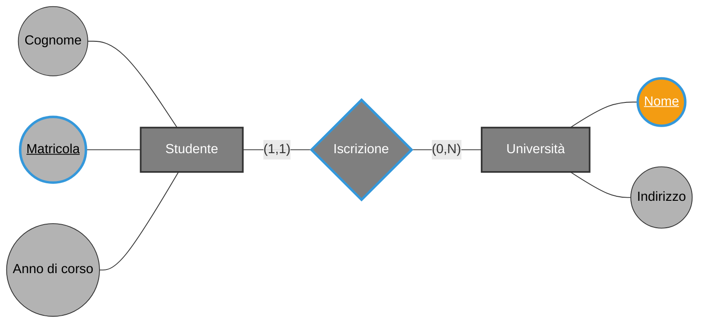

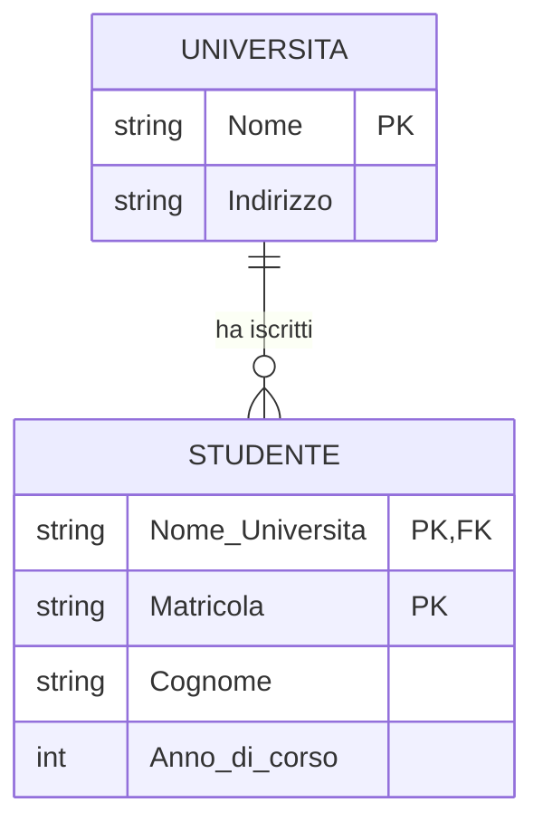