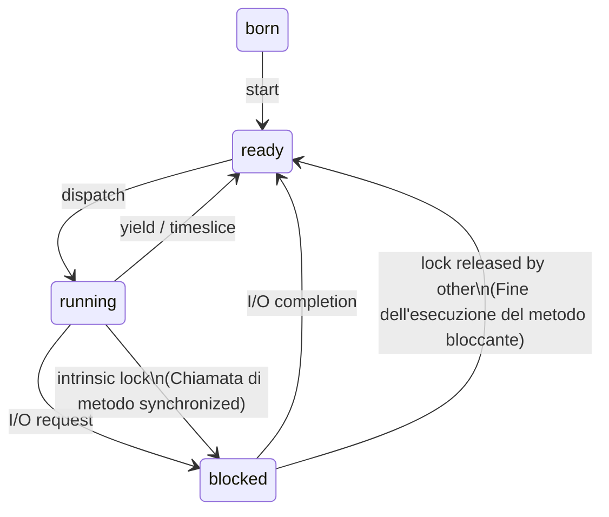

# Programmi Concorrenti e Sequenziali
La programmazione **concorrente** (multithreading) e la programmazione **sequenziale** (1 solo thread) godono di proprietà diverse riguardo 
- Un programma **sequenziale** eseguito ripetutamente con lo <mark style="background: #ADCCFFA6;">stesso input produce lo stesso risultato ogni volta</mark>
- Un programma **concorrente** dato lo <mark style="background: #ADCCFFA6;">stesso input può produrre un risultato diverso di volta in volta</mark>
## Interazioni tra agenti concorrenti
- **Cooperazione**
  Interazioni prevedibili e desiderate, la loro presenza è necessaria per la logica del programma
  Avviene tramite lo scambio di informazioni / eventi
  <mark style="background: #ADCCFFA6;">Sincronizzazione diretta o esplicita</mark>
- **Competizione**
  Gli agenti competono per accedere ad un una risorsa **condivisa**, richiede di implementare delle politiche di accesso
  <mark style="background: #ADCCFFA6;">Sincronizzazione può essere indiretta o implicita</mark>

---
# Problemi di accesso a risorse condivise : Race Condition
## Cosa è?
È una situazione in cui diversi thread operano su una risorsa comune portando a un risultato finale imprevedibile che dipende dall'ordine in cui essi effettuano le loro operazioni

Il problema viene causato da 
- **Mancanza di atomicità**
  Le operazioni di aggiornamento sui dati spesso non sono atomiche (cioè non sono indivisibili in singole istruzioni hardware) rendendole interrompibili
- **Thread Interleaving**
  Lo scheduler assegna la CPU a ogni thread per una quantità di tempo limitata
  Allo scadere di questo tempo, lo scheduler toglie la CPU al thread in esecuzione per assegnarla a un altro potendo frammentare e inframmezzare le operazioni

Queste due problematiche portano a 
- **Interferenze**
  Sovrapposizioni aleatorie di letture e scritture
- **Collisioni**
  Quando un thread aggiorna lo stato di una risorsa condivisa nel momento esatto che intercorre tra la lettura del dato da parte di un altro thread e il suo successivo aggiornamento
## Esempio
```java
class ContoCorrente {
    private float saldo;

    public ContoCorrente(float saldoIniziale) {
        saldo = saldoIniziale;
    }

    /**
     * Questo metodo non è atomico, cioè è interrompibile dallo scheduler.
     * L'operazione 'saldo += cifra' viene eseguita in più passi (lettura, calcolo, scrittura)
     * che possono essere inframmezzati da altri thread.
     */
    public void deposito(float cifra) {
        // Lettura del valore -> Calcolo -> Riscrittura (Interrompibile)
        saldo += cifra; 
    }

    /**
     * Anche il prelievo soffre di interferenza tra thread.
     * Se due thread eseguono prelievi simultanei, il controllo 'if' e l'aggiornamento
     * del saldo possono essere intervallati portando a uno stato inconsistente.
     */
    public void prelievo(float cifra) {
        if (saldo > cifra) {
            saldo -= cifra;
            return;
        }
        saldo = 0.0f;
    }

    public float saldo() {
        return saldo;
    }
}
```

---
# Meccanismi di Sincronizzazione
Sono i meccanismi che permettono di controllare l'ordine relativo delle varie attività dei processi / thread e a garantire la consistenza dei dati condivisi tra thread / processi
## Modello a Memoria Comune
### Cos'è?
È tipico di architetture multiprocessore, in cui più processori condividono un'unica memoria principale
### Come funziona?
#### Divisione delle componenti
L'interazione e la comunicazione tra i vari processi avvengono esclusivamente attraverso questa memoria condivisa

All'interno di questo modello un'applicazione concorrente è strutturalmente divisa in due insieme disgiunti
- **Componenti Attivi**
  Sono i processi o i thread che eseguono materialmente le operazioni
- **Componenti Passivi**
  Sono le entità fisiche o logiche su cui i thread operano
  Nel modello a memoria comune, ogni singola risorsa corrisponde a una struttura dati residente nella memoria condivisa
#### Diritto di accesso e controllo degli accessi
Un processo può accedere a una risorsa solo se possiede il **diritto di accesso** che permette di operare su una certa risorsa

Se il diritto di accesso non è garantito l'operazione viene abortita e viene sollevata un'eccezione per prevenire errori dovuti all'interferenza con altri processi
#### Gestore della risorsa
Per ogni risorsa $R$, esiste un gestore $G_{R}$ che determina, istante per istante, quali processi / thread hanno il diritto di operare su di essa

Il gestore definisce un inseme $S_{R}(t)$, che contiene i processi / thread autorizzati ad accedere alla risorsa in un dato istante $t$

Il gestore ha 3 compiti principali 
1. Mantenere aggiornato lo stato della risorsa
2. Fornire i meccanismi di richiesta / rilascio dell'accesso per i processi
3. Definire la strategia di allocazione, ovvero determinare quando, a chi e per quanto tempo concedere l'accesso
## Semaforo
### Cos'è?
Un semaforo è una variabile intera che può essere manipolata solo attraverso due operazioni atomiche
- `acquire()` aspetta che la variabile sia maggiore di zero, e quindi la decrementa
- `release()` incrementa incondizionatamente la variabile
Permette di limitare l'accesso ad una risorsa condivisa
### Esempio
```java
import java.util.concurrent.*;

/**
 * Classe che utilizza un Semaforo per limitare l'accesso a una risorsa condivisa.
 * Un semaforo garantisce un numero massimo di accessi contemporanei.
 */
public class MaxAccessRes {
    // In Java la classe Semaphore è presente nel package java.util.concurrent
    private Semaphore sem;

    /**
     * Il costruttore inizializza il semaforo con una dimensione specifica (size).
     * Rappresenta una variabile intera che limita l'accesso alla risorsa.
     */
    public MaxAccessRes(int size) {
        this.sem = new Semaphore(size);
    }

    public void access() {
        try {
            /* * acquire(): Operazione atomica (non interrompibile).
             * Aspetta che la variabile sia maggiore di zero, e quindi la decrementa.
             * Se non ci sono permessi disponibili, il thread viene messo in una coda di attesa.
             */
            sem.acquire();

            // Blocco di codice che simula l'utilizzo della risorsa critica
            // Esempio classico: Connection Pool per database
            Thread.sleep(1000); 

        } catch (InterruptedException exc) {
            // Gestione dell'eventuale interruzione del thread durante l'attesa
        } finally {
            /* * release(): Operazione atomica che incrementa incondizionatamente la variabile.
             * Rilascia il permesso precedentemente acquisito.
             */
            sem.release();
        }
    }
}
```
## Sezione critica
### Cos'è?
È un particolare blocco di codice che può essere eseguito da un solo thread alla volta

Il suo obiettivo architetturale è quello di realizzare un protocollo di cooperazione tra i vari processi o thread per garantire la mutua esclusione

Assicura che quando un thread si trova all'interno della sua sezione critica, nessun altro thread possa entrarvi o interferire in quel momento
### Come funziona?
Si basa su un protocollo strutturato a step che disciplina l'accesso alla risorsa condivisa

Ogni thread che desidera eseguire quel blocco di codice deve attraversare tre fasi in sequenza
1. **Sezione di ingresso**
   Richiesta entrata nella sezione critica
2. **Selezione Critica**
   Esecuzione delle istruzioni nella sezione critica / accesso risorsa condivisa
3. Eventuale **sezione di uscita**
   Notificare altri processi
## Lock
È una variabile binaria manipolabile atomicamente

Ha due metodi 
- `lock()`
  Che richiede l'accesso esclusivo a una risorsa
- `unlock()`
  Rilascia i diritto di accesso a una risorsa

Una volta che un thread ha acquisito un lock, gli altri thread che richiedono il `lock()` si bloccano finchè il thread che lo detiene non lo rilascia

Per ogni lock deve essere gestita una coda di thread in attesa
### Esempio
```java
import java.util.concurrent.locks.*;

/**
 * Esempio di gestione della mutua esclusione tramite Lock.
 * Il Lock è una variabile logica binaria manipolabile atomicamente.
 */
public class SharedRes {
    // In Java sono presenti diverse implementazioni nel package java.util.concurrent.locks
    private Lock l = new ReentrantLock();
    private int counter = 0;

    public void increment() {
        /* * lock(): Metodo per acquisire il lock in maniera atomica.
         * Una volta acquisito, gli altri thread che richiedono il lock() 
         * si bloccano finché non viene rilasciato.
         */
        l.lock();
        
        try {
            // Inizio sezione critica
            try {
                counter++; // Incremento della risorsa condivisa
                Thread.sleep(1000); // Simulazione di un'operazione lunga
            } catch (InterruptedException e) {
                // Gestione dell'interruzione durante lo sleep
            }
        } finally {
            /* * unlock(): Rilascia il lock permettendo ad altri thread in coda di accedere.
             * È fondamentale metterlo nel blocco 'finally' per garantire il rilascio 
             * anche in caso di eccezioni.
             */
            l.unlock();
        }
    }
}
```

---
# Mutua esclusione Implicita : Metodi Synchronized
## Cos'è?
È un meccanismo di sincronizzazione di alto livello fornito nativamente dal linguaggio Java

Si realizza attraverso l'utilizzo della parola chiave **synchronized**, che può essere applicata alla dichiarazione di metodi interi o a specifici blocchi di codice

Viene definita "implicita" perchè si basa su un "lock intrinseco" che java associa di default a ogni singolo oggetto creato

Poichè ogni classe in Java estende la superclasse base `Object`, ogni istanza possiede naturalmente questo lock e può agire come un costrutto di tipo Monitor
## Come funziona?
L'attivazione di metodi java può essere resa mutuamente esclusiva tramite la specifica delle parole chiave **synchronized**

Java associa un lock intrenseco / implicito ad ogni oggetto che abbia almeno un metodo synchronized 

Poiche ogni oggetto in java estende la classe Object, ogni oggetto ha un suo lock
- 1 oggetto = 1 lock
- I dati modificabili con il metodo synchronized rappresentano la risorsa condivisa tra i thread
- Non si può usare synchronized su un costruttore né su singoli campi
Il fatto che un thread T1 sia in esecuzione all'interno di un metodo synchronized fa si che altri thread che richiedano l'esecuzione dello stesso o un altro metodo synchronized vengano messi in attesa che T1 completi l'esecuzione del metodo 

Quando un metodo synchronized viene invocato 
- Se l'oggetto non è bloccato l'oggetto viene bloccato e quindi il metodo è eseguito
- Se l'oggetto è bloccato, il thread chiamante viene sospeso fino a quando quello "bloccante" non rilascia il lock
## Diagrammi degli stati di un thread per metodi synchronized

## Esempio
```java
/**
 * Esempio di contatore thread-safe che utilizza la sincronizzazione intrinseca.
 * La parola chiave 'synchronized' garantisce la mutua esclusione: 
 * solo un thread alla volta può eseguire un metodo sincronizzato sulla stessa istanza.
 */
public class SynchronizedCounter {
    private int c = 0;

    /**
     * Incrementa il contatore in modo atomico.
     */
    public synchronized void increment() {
        // [Entrata]: Il thread acquisisce il lock dell'oggetto
        c++; 
        // [Uscita]: Il thread rilascia il lock dell'oggetto
    }

    /**
     * Decrementa il contatore in modo atomico.
     */
    public synchronized void decrement() {
        // [Entrata]: Il thread acquisisce il lock dell'oggetto
        c--; 
        // [Uscita]: Il thread rilascia il lock dell'oggetto
    }

    /**
     * Restituisce il valore corrente garantendo la visibilità della memoria.
     */
    public synchronized int value() {
        // [Entrata]: Il thread acquisisce il lock dell'oggetto
        return c; 
        // [Uscita]: Il thread rilascia il lock dell'oggetto
    }
}
```

## Controllo della granularità
C'è la possibilità di definire sezioni critiche pi<ù piccole di un metodo intero

Si può dire che all'interno di un metodo non sincronizzato c'è una sezione che è sincronizzato in relazione a un particolare oggetto
```java
public class ReadersWriters {
    private int readers = 0;
    private int writers = 0;
    private int content = 0;

    public int read() {
        /*
         * PRIMA SEZIONE CRITICA: Gestione dell'ingresso.
         * Si definisce un blocco sincronizzato in relazione a un particolare oggetto,
         * tipicamente 'this'.
         */
        synchronized(this) {
            // Se ci sono scrittori attivi, il lettore deve attendere
            while (writers > 0) {
                try {
                    wait(); // Il thread si sospende rilasciando il lock
                } catch (InterruptedException e) {
                    // Gestione dell'interruzione durante l'attesa
                }
            }
            readers++; // Incrementa il numero di lettori attivi
        }

        // FASE DI LETTURA: Eseguita fuori dal blocco synchronized per permettere
        // a più lettori di leggere contemporaneamente (non è una sezione critica)
        try {
            Thread.sleep(50); // Simula l'operazione di lettura
        } catch (InterruptedException e) { }
        
        int contSnapshot = content;

        /*
         * SECONDA SEZIONE CRITICA: Gestione dell'uscita.
         * Un blocco formalmente delimitato che è sincronizzato per aggiornare lo stato.
         */
        synchronized(this) {
            readers--; // Il lettore ha finito
            // Se sono l'ultimo lettore, notifico eventuali scrittori in attesa
            if (readers == 0) {
                notifyAll();
            }
        }

        return contSnapshot;
    }
}
```
## Variabili Statiche
## Ereditarietà
---
# Monitor