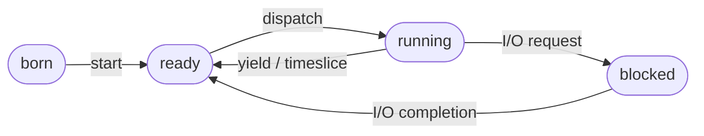

# Come creo un thread in java?
Per creare un thread in java ho 2 modi
1. **Estendere** la classe `java.lang.Thread` che contiene un metodo `run()` vuoto
2. **Implementare** l'interfaccia `java.lang.Runnable`

## Classe Thread
### Cos'è?
È la classe principale utilizza per la gestione dei thread

Rappresenta un'astrazione offerta e gestita dalla JVM per definire i thread e gestire l'interazione con il sistema operativo sottostante per la loro effettiva esecuzione
### Cosa fa?
Fornisce gli  strumenti necessari per eseguire porzioni di codice in modo concorrente rispetto al thread principale
### Cosa Contiene?
- `run()`
  È un metodo vuoto, ed è il contenitore principale in cui va inserito il codice che il thread dovrà eseguire
- `start()`
  Serve per avviare effettivamente il thread
  Quando invocato, sposta il thread nello stato di Ready e indica allo scheduler che può avviare l'esecuzione concorrente chiamando in automatico il metodo `run()`
- `interrupt()`
  Invia una richiesta di terminazione settando un flag
- `isInterrupted()` / `interrupted()`
  Servono a verificare il flag di interrupt
### Esempio
```java
public class MyProgram {
    public static void main(String[] args) {
        // Ottiene il riferimento al thread in esecuzione (in questo caso il main)
        Thread t = Thread.currentThread();
        System.out.println("Thread corrente: " + t);

        // Cambia il nome del thread corrente
        t.setName("Mio Thread");

        System.out.println("Dopo cambio nome: " + t);
    }
}
```
## Interfaccia Runnable
### Cos'è?
È un interfaccia standard di java che rappresenta il <mark style="background: #ADCCFFA6;">metodo migliore per realizzare e gestire l'esecuzione dei thread</mark>
### Cosa fa?
Serve a definire il blocco di codice che deve essere eseguito in parallelo, separandolo dalla gestione fisica del thread vero e proprio

Il suo funzionamento prevede i seguenti passaggi
1. Definire una classe che implementi `Runnable` e implementare il suo metodo `run()` 
2. Creare un istanza di questa classe
3. Istanziare un nuovo oggetto della classe base `Thread`, passando al suo costruttore l'istanza della classe `Runnable`
4. Richiamare il metodo `start()` sull'istanza del thread cosi' che utilizzi ed avvi il metodo `run()` fornito dall'oggetto `Runnable`
### Cosa contiene?
Contiene unicamente la dichiarazione del metodo `run()`
### Esempio
```java
public class RunnableExample implements Runnable {

    @Override
    public void run() {
        System.out.println("Ciao!");
    }

    public static void main(String arg[]) {
        RunnableExample re = new RunnableExample();

        // In questo modo t1 contiene un riferimento a re
        Thread t1 = new Thread(re);

        // Quando il metodo t1.start() viene chiamato, 
        // si esegue il metodo run() fornito da re
        t1.start();
    }
}
```
---
# Stati di un thread

- **Created**
  È lo stato iniziale che si verifica nel momento in cui viene istanziato un nuovo oggetto `Thread`
  In questa fase il thread esiste come oggetto in memoria, ma non è ancora pronto per eseguire il suo codice
- **Ready**
  Il thread entra in questo stato non appena viene invocato il metodo `start()` sulla sua istanza
  In questa fase il thread non entra immediatamente in esecuzione, ma viene accodato in un "Ready Set" in attesa che lo scheduler decida di assegnarli il processo
- **Running**
  Quando lo scheduler seleziona il thread dalla coda dei processi pronti, il thread passa nello stato Running e inizia ad eseguire effettivamente le istruzioni contenute nel metodo `run()`
  In questa fase, il thread può tornare momentaneamente allo stato **ready** se lo scheduler decide di assegnare la CPU a qualcun altro o se il thread cede volontariamente l'esecuzione tramite il metodo `yield()`
- **Alive**
  Questo non è un singolo stato, ma un macro-stato
  Un thread è considerato alive dal momento in cui viene chiamato fino a quando la sua esecuzione non si conclude
- **Terminated**
  Un thread entra definitivamente in questo stato quando il metodo `run()` ritorna

## IllegalThreadStateException
Una volta che un thread ha raggiunto lo stato **terminated** non può più esser rieseguito, se si prova a far ciò la JVM lancerà un eccezione `IllegalThreadStateException`


---
# Mettere in Pausa un Thread
## Perchè?
Lo si fa principalmente per rallentare l'esecuzione
## Come?
Il modo corretto per mettere in pausa un thread è chiamare il metodo statico `Thread.sleep(milli)`, che <mark style="background: #ADCCFFA6;">ferma l'esecuzione del thread corrente per i millisecondi specificati</mark> 

Bisogna tenere conto che questo metodo può lanciare un `InterruptException` che deve essere catturata e gestita tramite un blocco try-catch, inoltre, <mark style="background: #BBFABBA6;">non è possibile usare questo metodo per mettere in pausa un thread diverso da quello in esecuzione</mark>

## Esempio
```java
public class ThreadSleep extends Thread {
    public ThreadSleep(String s) { 
        super(s); 
    }

    public void run() {
        for (int i = 0; i < 5; ++i) {
            System.out.println(getName() + ": in esecuzione.");
            try {
                Thread.sleep(200);
            }
            catch (InterruptedException e) {
                System.err.println(getName() + ": interrotto");
                break;
            }
        }
        System.err.println(getName() + ": finito");
    }
}
```
---
# Cancellazione di un Thread
## Tipi di cancellazione
- Cancellazione **immediata**
  Il thread viene interrotto e terminato istantaneamente dal sistema nel momento stesso in cui arriva la richiesta
- Cancellazione **differita**
  La richiesta di interruzione non ferma subito il thread, al contrario, il thread deve controllare periodicamente se qualcuno gli ha chiesto di terminare
  Questa da al thread il tempo di chiudere i propri compiti in modo pulito ed effettuare una terminazione ordinata
## Perchè?
- Il thread (o il processo figlio) sta utilizzando troppe risorse del sistema, come eccessivo tempo di calcolo o memoria
- Le funzionalità o i calcoli che il thread stava svolgendo non sono più necessari al programma principale
- Il processo padre sta terminando e il sistema impone che i figli non possano continuare ed esistere dopo la morte del creatore
## Come?
In java, la cancellazione è un meccanismo di comunicazione collaborativo tra i thread, si procede in questo modo 
1. **Impostare il flag**
   Si chiede al thread di terminare invocando il suo metodo `interrupt()`
   Questo metodo non ferma l'esecuzione, ma si limita a impostare un flag di interruzione all'interno del thread bersaglio, per poi ritornare
2. **Controllo Periodico**
   Essendo un modello differito, il thread in esecuzione deve essere stato programmato per controllare periodicamente il suo stato
   Può farlo usando i metodi `isInterrupted()` oppure `Thread.interrupted()`
   Se scopre che è stata richiesta l'interruzione, il thread dovrà uscire volontariamente dal proprio metodo `run()`
3. **Gestione delle Eccezioni**
   Se il thread riceve l'interruzione mentre si trova in pausa, la JVM interviene automaticamente, risveglia il thread e lancia un'eccezione `InterruptedException`
   Il programmatore deve inserire il codice del thread all'interno di un blocco `try-catch` e, nel momento in cui l'eccezione viene intercettata, decidere come gestire l'uscita ordinata dall'esecuzione
   importante ricordare che se un thread non invoca mai metodi di attesa e non viene programmato per controllare il proprio flag, la richiesta di `interrupt()` non sortirà alcun effetto
## Esempio
```java
public class MyThread extends Thread {

    @Override
    public void run() {
        // Il thread esegue un ciclo potenzialmente lungo
        while (true) { // 'condizione' nell'immagine
            
            /* * Controllo periodico dello stato di interruzione.
             * Thread.interrupted() restituisce true se qualcuno ha chiamato interrupt() 
             * su questo thread. Nota: questo metodo resetta il flag di interruzione.
             */
            if (Thread.interrupted()) {
                // Log dell'interruzione avvenuta
                System.err.println(getName() + ": interrotto");
                
                /* * Uscita pulita dal ciclo. 
                 * Senza questo 'break', il thread continuerebbe l'esecuzione 
                 * nonostante la richiesta di interruzione.
                 */
                break;
            }

            // ... qui andrebbe la logica di business del thread ...
        }
    }
}
```
---
# Threading Implicito
Il thread pooling abbinato al meccanismo fork-join è un modello di **threading implicito**, ovvero una tecnica in cui la creazione e la gestione fisica dei thread vengono delegate direttamente ai compilatori e alle librerie

---
# Thread Pool e Modello Fork-Join
## Cos'è un Thread Pool?
Il thread pool è un approccio in cui viene pre-allocato un insieme fisso d thread che rimangono in attesa di ricevere del lavoro
## Cos'è il Modello Fork-Join?
È un paradigma di programmazione parallela che si appoggia ai thread pool per scomporre compiti complessi in sotto-attività, è particolarmente efficace per la programmazione **ricorsiva**
## Come funziona?
1. **Fork (Divisione del lavoro)**
	1. Un'attività principale suddivide (fork) il problema in più sotto-attività
	2. Queste sotto-attività vengono eseguite indipendentemente e possono, a loro volta suddividere ulteriormente
2. **Join ( Sincronizzazione e Unione dei Risultati)**
	1. L'attività principale attende che tutte le sotto-attività vengano completata
	2. I risultati delle sotto-attività vengono combinati per produrre il risultato finale
## Esempio
```java
import java.util.concurrent.*;

/**
 * Classe che rappresenta il compito (task) di sommare gli elementi di un array.
 * Estende RecursiveTask<Integer> perché vogliamo che l'operazione restituisca un risultato (Integer).
 */
public class SumTask extends RecursiveTask<Integer> {
    
    // Dimensione massima del sottoproblema: se l'intervallo è più piccolo, elaboriamo sequenzialmente
    static final int THRESHOLD = 1000; 
    
    private int begin; // Indice iniziale dell'array per questo task
    private int end;   // Indice finale dell'array per questo task
    private int[] array; // Riferimento all'array globale da sommare

    // Costruttore per inizializzare i parametri del task
    public SumTask(int begin, int end, int[] array) {
        this.begin = begin;
        this.end = end;
        this.array = array;
    }

    /**
     * Metodo principale che contiene la logica del "divide et impera".
     */
    @Override
    protected Integer compute() {
        // Caso Base: se il problema è abbastanza piccolo, lo risolviamo direttamente
        if (end - begin < THRESHOLD) {
            int sum = 0;
            for (int i = begin; i <= end; i++) {
                sum += array[i];
            }
            return sum;
        } 
        // Caso Ricorsivo: dividiamo il problema in due sottoproblemi più piccoli
        else {
            int mid = (begin + end) / 2;
            
            // Creiamo due nuovi task per le due metà dell'intervallo
            SumTask leftTask = new SumTask(begin, mid, array);
            SumTask rightTask = new SumTask(mid + 1, end, array);
            
            // fork(): invia il task al pool per l'esecuzione asincrona (in parallelo)
            leftTask.fork();
            rightTask.fork();
            
            // join(): attende il completamento del task e ne recupera il risultato
            // Sommiamo i risultati dei due sottoproblemi e li restituiamo
            return rightTask.join() + leftTask.join();
        }
    }

    // Esempio di utilizzo (corrisponde alla parte sinistra della tua slide)
    public static void main(String[] args) {
        int SIZE = 10000; // Esempio di dimensione array
        int[] array = new int[SIZE]; // Popola l'array con valori reali per un test
        
        // Creazione del pool di thread specializzato per il Fork-Join
        ForkJoinPool pool = new ForkJoinPool();
        
        // Creazione del task radice che copre l'intero array
        SumTask task = new SumTask(0, SIZE - 1, array);
        
        // invoke(): avvia l'esecuzione del task sul pool e attende il risultato finale
        int sum = pool.invoke(task);
        
        System.out.println("Somma totale: " + sum);
    }
}
```